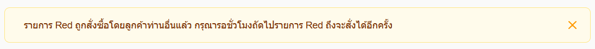
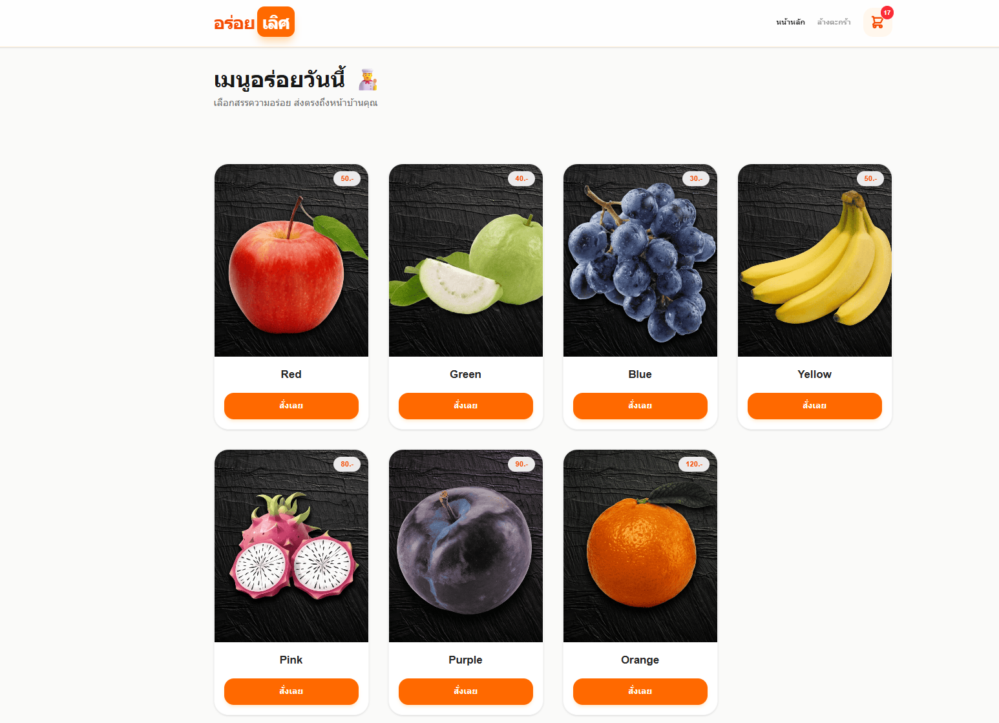
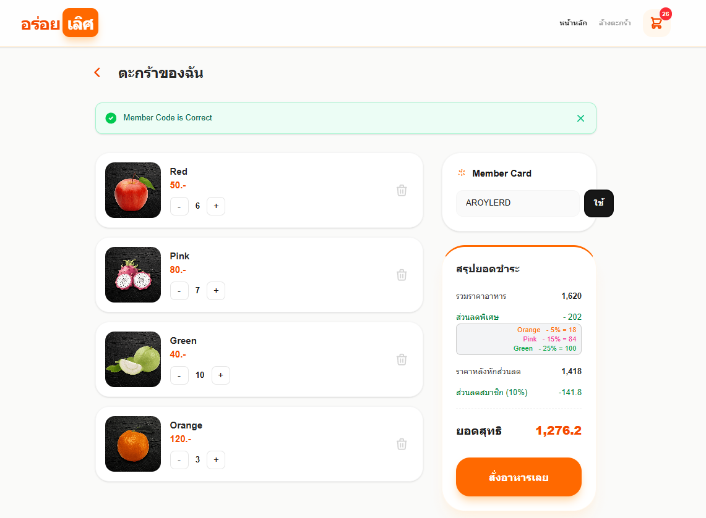

นี่คือโปรเจคร้านอาหารร้าน AroyLerd เอาไว้ใช้สำหรับส่งงานTest เท่านั้นครับ
 
 
*** ระบบนี้ เป็นแค่ส่วน Frontend ที่รันด้วย Next.js จำเป็นต้อง Cloneและติดตั้ง Backend ด้วยครับ ***
 
*** เวอร์ชั่นNode ที่ผมใช้ Node v20.20.0 และ NPM 10.8.2 ***

## เริ่มรันโปรเจ็ค

1. หลังจากโคลนลงมาแล้วให้ สร้างไฟล์ .env และ เพิ่มโค้ด NEXT_PUBLIC_BACKEND_URL=http://localhost:3001 เพื่อระบุ URL หลังบ้านครับ ส่วนหน้าบ้านจะรันด้วย Port Default 3000 ครับ
2. พิมพ์คำสั่ง npm install
3. พิมพ์คำสั่ง npm run dev

*** หลังจากนี้ให้Cloneและติดตั้ง Backend ด้วยครับ ระบบจึงจะทำงานได้ ***

## อธิบายระบบ
1. หน้าแรก Fetch รายการอาหารแบบ SSR ในการดึงข้อมูลผ่าน API หลังบ้าน
2. เมื่อเพิ่มรายการอาหารลงตะกร้า ระบบจะเก็บข้อมูลและจำนวนลง LocalStorage
3. หน้า Cart สามารถใส่โค้ด AROYLERD เพื่อได้รับส่วนลด 10%
4. หน้า Cart เมื่อมีการอัพเดทรายการสินค้า หรือใส่ Member Code  ระบบจะส่งข้อมูลทั้งหมดเข้า API ไปคำนวนที่ Backend และ Response ข้อมูลส่วนลดและราคาทั้งหมดกลับมาแสดง
5. ระบบใช้ Cookie ในการสร้างผู้ใช้โดยอัตโนมัติ โดยผูกกับบราวเซอร์
6. เมื่อกดสั่งอาหารรายการ โดยมีรายการRed ระบบจะจดจำว่าผู้ใช้นี้ +เลขขั่วโมงนี้ มีการสั่งซื้อไปแล้ว ถ้าผู้ใช้อื่นเข้ามาสั่งรายการ Red อีก ระบบจะแจ้งเตือนว่า มีผู้อื่นสั่งไปแล้ว 

 
 

## รูปภาพเว็บไซต์
 
